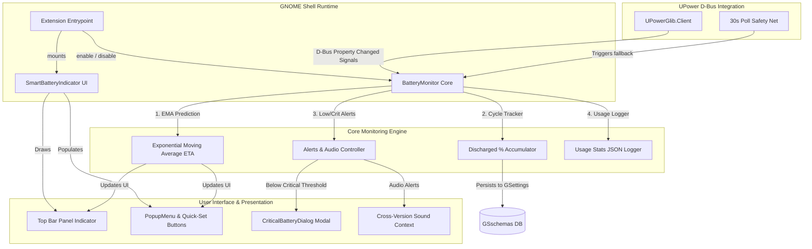

# Smart Battery Alert ⚡🔋

A **lightweight**, **non-invasive**, and **highly compatible** GNOME Shell extension that gives you full control over your laptop's battery health — without touching the BIOS, kernel, or system files. 

> **Why does this exist?** Most consumer laptops (HP, Dell, Asus, and many others) do not support BIOS-level or hardware-level charge limits on Linux. This extension solves this "99% problem" by providing **smart notifications**, **persistent screen-blocking alerts**, and **precise charge predictions** to let you manage your battery health manually but effortlessly.

---

## 🏗️ System Architecture

Smart Battery Alert is designed to be fully event-driven, operating asynchronously through D-Bus notifications via the system `UPower` service. This ensures **zero CPU utilization** when the battery state is idle.



---

## ✨ Features

### 🔋 Smart Low Battery Alerts
* **Low Battery Alerts**: Starts alerting the moment your battery drops below **30%** (fully customizable from 15% to 50%).
* **Periodic Intervals**: Rather than spamming you, it sends a neat notification for every configured **2% decrease** (adjustable from 1% to 5%).
* **Persistent Critical Interlock**: Below the critical threshold (default **20%**), a **persistent modal dialog** blocks the desktop. This window uses a custom interlock that **cannot be dismissed** unless a charger is connected, forcing immediate action to protect battery longevity.

### 🛡️ Smart Charge Limit Alarms
* **Unplug Notifications**: Set a charge limit of **70%**, **80%**, or **90%** with a single click. When your battery reaches this threshold, the extension alerts you to unplug.
* **Continuous Overcharge Alarms**: If you leave the charger plugged in, it sends a notification for **every 1% increase** beyond your configured limit to keep you aware.
* **Bi-directional Live Synchronization**: Clicking a quick-set button (70/80/90%) in either the top bar menu or the preferences panel instantly synchronizes both UIs and transitions the visual checkmark graphics (`emblem-ok-symbolic` vs `go-next-symbolic`) in real-time.
* **Non-Invasive Architecture**: Operates entirely in user space. It does not modify kernel parameters, charge controllers, or BIOS settings.

### ⚡ Charge Time Prediction
* **EMA-Smoothed ETA**: Uses an **Exponential Moving Average (EMA)** algorithm with an alpha smoothing factor ($\alpha = 0.3$) to filter out noisy sensor readings from high system workloads.
* **Absolute Clock Time**: Shows the **exact clock time** your battery will reach the limit (e.g., _"Charged by 12:15 PM"_) instead of a vague duration like _"in 2 hours 15 minutes"_.

### 📊 Battery Health & Cycles Tracking
* **Capacity Degradation Monitoring**: Automatically tracks full capacity degradation over time against the design capacity, sending a warning when battery health drops below a configured threshold (default **80%**). See the `Health Warning Threshold` setting for automatic wear alerts.
* **Precise Cycle Accumulation**: Because hardware cycle registers are frequently missing or inaccurate on Linux, the extension accumulates discharge percentages in a private database. Dropping a cumulative **100% discharge equals 1 full cycle**, persisting in your system schema.

### 📈 Usage Statistics Logging
* **Usage Logs**: Automatically logs time spent charging vs. time spent discharging.
* **Local Persistence**: Stores your usage statistics and health degradation history in local `GSettings` as serialized JSON strings for long-term tracking.

### ⚙️ Real-time UI & Settings Reactivity
* **Zero-Lag Preference Response**: The core engine connects directly to the GSettings `changed` signals. Toggling settings (e.g. *Show Battery Percentage*, *Charge Prediction*, or *Charge Limit*) in the Preferences Window or Extension Manager immediately updates the GNOME panel top bar and popup menu without requiring a system reboot or waiting for a battery state event.

### 🔊 Dynamic & Reliable Sound Alerts
* **System Sound Integration**: Plays customizable system sound effects for battery events (low battery, charge limit, and full charge).
* **Out-of-the-box Reliability**: Uses standard XDG/Freedesktop sound events (`'dialog-warning'` and `'dialog-information'`) that are guaranteed to exist on all Linux distributions, preventing silent audio failures.
* **Sound Volume Slider**: Built-in volume controller (0-100%) to adapt to your environment.
* **Cross-Version Compatibility**: Implements fallback trees supporting GNOME 43 through 50's evolving audio playback APIs seamlessly.

### 💤 Smart Shutdown Workflow Helper
* **Shutdown Tips**: If you decide to shut down your laptop while it's charging, the popup menu displays a helpful tip:
  _"📱 Set a phone alarm for 12:15 PM, then shut down safely."_
  This ensures the extension remains useful even when the computer is powered off!

---

## 📦 Installation

### Manual Installation

Clone the repository and build the extension schemas:

```bash
git clone https://github.com/KomeshBathula/smart-battery-alert.git
cd smart-battery-alert
make install
```

Then restart GNOME Shell:
* **Wayland**: Log out of your session and log back in.
* **X11**: Press `Alt + F2`, type `r`, and press `Enter`.

Finally, enable the extension:
```bash
gnome-extensions enable smart-battery-alert@komesh.dev
```

### Uninstallation

To completely clean up and remove the extension:

```bash
make uninstall
```

---

## ⚙️ Configuration & Customization

Open the system **Extensions** preferences app or launch the preferences window directly from the command line:

```bash
gnome-extensions prefs smart-battery-alert@komesh.dev
```

### Configurable Preferences

| Setting | Default | Description |
|---------|---------|-------------|
| **Show Battery Percentage** | `true` (Enabled) | Displays the current percentage directly in the top panel bar. |
| **Fallback Poll Interval** | `30s` | Polling interval safety net to ensure updates if D-Bus signals are missed. |
| **Low Battery Threshold** | `30%` | Triggers low battery notifications below this level (range: 15% - 50%). |
| **Critical Battery Threshold** | `20%` | Triggers the persistent modal lockout below this level (range: 5% - 25%). |
| **Alert Every N%** | `2%` | Frequency of discharge notifications (range: 1% - 5%). |
| **Charge Limit** | `80%` | Charge limit threshold (range: 60% - 100%). |
| **Charge Prediction** | `true` (Enabled) | Renders estimated charge completion times. |
| **Health Warning Threshold** | `80%` | Warns if full battery capacity drops below this percentage (range: 50% - 95%). |
| **Enable Sound Alerts** | `true` (Enabled) | Play localized audio sounds alongside notifications. |
| **Sound Volume** | `50%` | Adjust the alert audio volume (range: 0 - 100). |

---

## 🐧 Compatibility

Smart Battery Alert has been optimized and tested on:

| Component | Supported |
|---|---|
| **GNOME Shell** | `43`, `44`, `45`, `46`, `47`, `48`, `49`, `50` |
| **Linux Distros** | Fedora, Ubuntu, Arch Linux, Debian, openSUSE, or any distro running `UPower` |

---

## 🤝 Contributing

1. Fork the repository.
2. Create your feature branch: `git checkout -b feature/amazing-feature`
3. Commit your changes: `git commit -m 'Add amazing feature'`
4. Push to the branch: `git push origin feature/amazing-feature`
5. Open a **Pull Request**.

---

## 📄 License

This project is licensed under the GPL-3.0-or-later License — see the [LICENSE](LICENSE) file for details.

---

## 👤 Author

**Komesh Bathula** — [@KomeshBathula](https://github.com/KomeshBathula)

---

> _Built with ❤️ for the Linux community. Because your battery deserves better._
